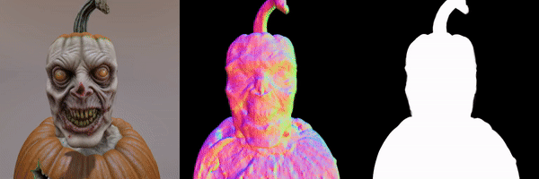

<p align="center">
  This is the official implementation of the paper
</p>

<div id="user-content-toc" display="inline">
  <ul align="center" style="list-style: none;">
    <summary>
      <h1>Score Distillation via Reparametrized DDIM</h1>
    </summary>
  </ul>

<p align="center">
  <a href="https://arxiv.org/abs/2405.15891">
    
  </a>
  <a href="https://lukoianov.com/sdi">
    
  </a>
</p>

<p align="center">
  
<!-- 
<br/> -->
</p>


<p align="center">
    <a class="active text-decoration-none" href="https://lukoianov.com">Artem Lukoianov</a><sup> 1</sup>,  &nbsp;
    <a class="active text-decoration-none" href="https://scholar.google.com/citations?user=aP0OakUAAAAJ&amp;hl=en">Haitz Sáez de Ocáriz Borde</a><sup> 2</sup>, &nbsp;
    <a class="active text-decoration-none" href="https://kgreenewald.github.io">Kristjan Greenewald</a><sup> 3</sup>, &nbsp;
    <a class="active text-decoration-none" href="https://scholar.google.com.br/citations?user=ow3r9ogAAAAJ&amp;hl=en">Vitor Campagnolo Guizilini</a><sup> 4</sup>, &nbsp;
    <a class="active text-decoration-none" href="https://scholar.google.ch/citations?user=oLi7xJ0AAAAJ&amp;hl=en">Timur Bagautdinov</a><sup> 5</sup>, &nbsp;
    <a class="active text-decoration-none" href="https://www.vincentsitzmann.com">Vincent Sitzmann</a><sup> 1</sup>, &nbsp;
    <a class="active text-decoration-none" href="https://people.csail.mit.edu/jsolomon/">Justin Solomon</a><sup> 1</sup>
</p>
<p align="center">
  <span class="author-block"><sup>1 </sup>Massachusetts Institute of Technology,</span>&nbsp;
  <span class="author-block"><sup>2 </sup>University of Oxford,</span>&nbsp;
  <span class="author-block"><sup>3 </sup>MIT-IBM Watson AI Lab, IBM Research,</span>&nbsp;
  <span class="author-block"><sup>4 </sup>Toyota Research Institute,</span>&nbsp;
  <span class="author-block"><sup>5 </sup>Meta Reality Labs Research</span>
</p>
<p align="center"><b>
| <a href="https://github.com/HeliosZhao/Animate124/tree/threestudio">Animate-124</a> | <a href="https://github.com/DSaurus/threestudio-4dfy">4D-fy</a> | <a href="https://github.com/baaivision/GeoDream/tree/threestudio">GeoDream</a> | <a href="https://github.com/DSaurus/threestudio-dreamcraft3D">DreamCraft3D</a> | <a href="https://github.com/huanngzh/threestudio-dreamwaltz">Dreamwaltz</a> | <a href="https://github.com/KU-CVLAB/3DFuse-threestudio">3DFuse</a> | <a href="https://github.com/cxh0519/Progressive3D">Progressive3D</a> |  <a href="https://github.com/cxh0519/threestudio-gaussiandreamer">GaussianDreamer</a> |  <a href="https://github.com/DSaurus/threestudio-3dgs">Gaussian Splatting</a> | <a href="https://github.com/DSaurus/threestudio-mvdream">MVDream</a> | <a href="https://github.com/DSaurus/threestudio-meshfitting">Mesh-Fitting</a> |
</b>

## News
- 21/10/2024: Thank [Amir Barda](https://github.com/amirbarda) for implementation of [MagicClay](https://github.com/amirbarda/MagicClay)! Follow the instructions on its website to give it a try.
- 12/03/2024: Thank [Matthew Kwak](https://github.com/mskwak01) and [Inès Hyeonsu Kim](https://github.com/Ines-Hyeonsu-Kim) for implementation of [3DFuse](https://github.com/KU-CVLAB/3DFuse-threestudio)! Follow the instructions on its website to give it a try.
- 08/03/2024: Thank [Xinhua Cheng](https://github.com/cxh0519/) for implementation of [GaussianDreamer](https://github.com/cxh0519/threestudio-gaussiandreamer)! Follow the instructions on its website to give it a try.
- 01/03/2024: Thank [Xinhua Cheng](https://github.com/cxh0519/) for implementation of [Progressive3D](https://github.com/cxh0519/Progressive3D)! Follow the instructions on its website to give it a try.
- 09/01/2024: Thank [Zehuan Huang](https://github.com/huanngzh) for implementation of 3D human avatar generation [Dreamwaltz](https://github.com/huanngzh/threestudio-dreamwaltz)! Follow the instructions on its website to give it a try.
- 06/01/2024: Thank [Baorui Ma](https://github.com/mabaorui) for implementation of [GeoGream extensions](https://github.com/baaivision/GeoDream/tree/threestudio)! Follow the instructions on its website to give it a try.
- 05/01/2024: Implemented HiFA. Follow the instructions [here](https://github.com/threestudio-project/threestudio#hifa-) to try all three variants.
- 23/12/2023: Thank [Yuyang Zhao](https://github.com/HeliosZhao) for implementation of image-to-4D generation extensions [Animate-124](https://github.com/HeliosZhao/Animate124/tree/threestudio)! Follow the instructions on the extensions website to give it a try.
- 18/12/2023: Implementation of [4D-fy](https://github.com/DSaurus/threestudio-4dfy) for 4D generation and [DreamCraft3D](https://github.com/DSaurus/threestudio-dreamcraft3D) for high-quality image-to-3D generation as the custom extensions! Follow the instructions on the extensions website to give it a try.
- 13/12/2023: Implementation supporting [Stable Zero123](https://stability.ai/news/stable-zero123-3d-generation) for 3D generation from a single image! Follow the instructions [here](https://github.com/threestudio-project/threestudio#stable-zero123) to give it a try.
- 30/11/2023: Implementation of [MVDream](https://github.com/DSaurus/threestudio-mvdream), [Gaussian Splatting](https://github.com/DSaurus/threestudio-3dgs) as the custom extensions. You can also use neural representation to fit a mesh by [Mesh-Fitting](https://github.com/DSaurus/threestudio-meshfitting).
- 30/11/2023: Implementation of [custom extension system](https://threestudio-project.github.io/threestudio-extensions/) and you can add your extensions in [this project](https://github.com/threestudio-project/threestudio-extensions).
- 25/06/2023: Implementation of [Magic123](https://guochengqian.github.io/project/magic123/)! Follow the instructions [here](https://github.com/threestudio-project/threestudio#magic123-) to give it a try.
- 06/07/2023: Join our [Discord server](https://discord.gg/ejer2MAB8N) for lively discussions!
- 03/07/2023: Try text-to-3D online in [HuggingFace Spaces](https://huggingface.co/spaces/bennyguo/threestudio) or using our [self-hosted service](http://t23-g-01.threestudio.ai) (GPU support from Tencent). To host the web interface locally, see [here](https://github.com/threestudio-project/threestudio#gradio-web-interface).
- 20/06/2023: Implementations of Instruct-NeRF2NeRF and Control4D for high-fidelity 3D editing! Follow the instructions for [Control4D](https://github.com/threestudio-project/threestudio#control4d-) and [Instruct-NeRF2NeRF](https://github.com/threestudio-project/threestudio#instructnerf2nerf-) to give it a try.
- 14/06/2023: Implementation of TextMesh! Follow the instructions [here](https://github.com/threestudio-project/threestudio#textmesh-) to give it a try.
- 14/06/2023: Implementation of [prompt debiasing](https://arxiv.org/abs/2303.15413) and [Perp-Neg](https://perp-neg.github.io/)! Follow the instructions [here](https://github.com/threestudio-project/threestudio#tips-on-improving-quality) to give it a try.
- 29/05/2023: An experimental implementation of using [Zero-1-to-3](https://zero123.cs.columbia.edu/) for 3D generation from a single image! Follow the instructions [here](https://github.com/threestudio-project/threestudio#zero-1-to-3-) to give it a try.
- 26/05/2023: Implementation of [ProlificDreamer](https://ml.cs.tsinghua.edu.cn/prolificdreamer/)! Follow the instructions [here](https://github.com/threestudio-project/threestudio#prolificdreamer-) to give it a try.
- 14/05/2023: You can experiment with the SDS loss on 2D images using our [2dplayground](2dplayground.ipynb).
- 13/05/2023: You can now try threestudio on [Google Colab](https://colab.research.google.com/github/threestudio-project/threestudio/blob/main/threestudio.ipynb)!
- 11/05/2023: We now support exporting textured meshes! See [here](https://github.com/threestudio-project/threestudio#export-meshes) for instructions.


## Installation


<p align="center">
  For any questions please shoot an email to <a href="mailto:arteml@mit.edu">arteml@mit.edu</a>
</p>

## Prerequisites
For this project we recommend using a UNIX server with CUDA support and a GPU with at least 40GB of VRAM.
In the case if the amount of available VRAM is limited, we recommend reducing the rendering resolution by adding the following argument to the running command:

```sh
data.width=128 data.height=128
```

Please note that this will reduce the quality of the generated shapes.

## Installation

This project is based on [Threestudio](https://github.com/threestudio-project/threestudio).
Below is an example of the installation used by the authors for Ubuntu 22.04 and CUDA 12.3:

```sh
conda create -n threestudio-sdi python=3.9
conda activate threestudio-sdi

# Consult https://pytorch.org/get-started/locally/ for the latest PyTorch installation instructions
conda install pytorch torchvision torchaudio pytorch-cuda=12.1 -c pytorch -c nvidia

pip install ninja
pip install -r requirements.txt
```

For additional options please address the official installation instructions of Threestudio [here](https://github.com/threestudio-project/threestudio?tab=readme-ov-file#installation) to install threestudio.

## Running generation
The proccess of generating a shape is similar to the one described in the [threestudio](https://github.com/threestudio-project/threestudio?tab=readme-ov-file#quickstart) documentation.
Make sure you are using the SDI config file, like below.
Here are a few examples with different prompts:

```sh
python launch.py --config configs/sdi.yaml --train --gpu 0 system.prompt_processor.prompt="pumpkin head zombie, skinny, highly detailed, photorealistic"

python launch.py --config configs/sdi.yaml --train --gpu 1 system.prompt_processor.prompt="a photograph of a ninja"

python launch.py --config configs/sdi.yaml --train --gpu 2 system.prompt_processor.prompt="a zoomed out DSLR photo of a hamburger"

python launch.py --config configs/sdi.yaml --train --gpu 3 system.prompt_processor.prompt="bagel filled with cream cheese and lox"
```

The results will be saved to `outputs/score-distillation-via-inversion/`.

### Export Meshes

To export the scene to texture meshes, use the `--export` option. Threestudio currently supports exporting to obj+mtl, or obj with vertex colors:

```sh
# this uses default mesh-exporter configurations which exports obj+mtl
python launch.py --config path/to/trial/dir/configs/parsed.yaml --export --gpu 0 resume=path/to/trial/dir/ckpts/last.ckpt system.exporter_type=mesh-exporter
# specify system.exporter.fmt=obj to get obj with vertex colors
# you may also add system.exporter.save_uv=false to accelerate the process, suitable for a quick peek of the result
python launch.py --config path/to/trial/dir/configs/parsed.yaml --export --gpu 0 resume=path/to/trial/dir/ckpts/last.ckpt system.exporter_type=mesh-exporter system.exporter.fmt=obj
# for NeRF-based methods (DreamFusion, Magic3D coarse, Latent-NeRF, SJC)
# you may need to adjust the isosurface threshold (25 by default) to get satisfying outputs
# decrease the threshold if the extracted model is incomplete, increase if it is extruded
python launch.py --config path/to/trial/dir/configs/parsed.yaml --export --gpu 0 resume=path/to/trial/dir/ckpts/last.ckpt system.exporter_type=mesh-exporter system.geometry.isosurface_threshold=10.
# use marching cubes of higher resolutions to get more detailed models
python launch.py --config path/to/trial/dir/configs/parsed.yaml --export --gpu 0 resume=path/to/trial/dir/ckpts/last.ckpt system.exporter_type=mesh-exporter system.geometry.isosurface_method=mc-cpu system.geometry.isosurface_resolution=256
```

For all the options you can specify when exporting, see [the documentation](https://github.com/threestudio-project/threestudio/blob/main/DOCUMENTATION.md#exporters).

See [here](https://github.com/threestudio-project/threestudio#supported-models) for example running commands of all our supported models. Please refer to [here](https://github.com/threestudio-project/threestudio#tips-on-improving-quality) for tips on getting higher-quality results, and [here](https://github.com/threestudio-project/threestudio#vram-optimization) for reducing VRAM usage.

### Ablations
There are 5 main parameters in `system.guidance` reproduce the ablation results:
```yaml
enable_sdi: true # if true - the noise is obtained by running DDIM inversion procvess, if false - noise is sampled randomly as in SDS
inversion_guidance_scale: -7.5 # guidance scale for DDIM inversion process
inversion_n_steps: 10 # number of steps in the inversion process
inversion_eta: 0.3 # random noise added to in the end of the inversion process
t_anneal: true # if true - timestep t is annealed from 0.98 to 0.2 instead of sampled from U[0.2, 0.98] like in SDS
```

## 2D Generation

There are 2 main methods that allow to perform score distialltion in 2D with the insights from our paper.
The first one, as in 3D case, is inferring noise with DDIM inversion.
Absence of other views, however, allows us to use a second method - caching of $\kappa$, which is also provided in the notebook.
Please conuslt `2dplayground_SDI_version.ipynb` for more details. 

## Citing

If you find our project useful, please consider citing it:

```
@misc{lukoianov2024score,
    title={Score Distillation via Reparametrized DDIM}, 
    author={Artem Lukoianov and Haitz Sáez de Ocáriz Borde and Kristjan Greenewald and Vitor Campagnolo Guizilini and Timur Bagautdinov and Vincent Sitzmann and Justin Solomon},
    year={2024},
    eprint={2405.15891},
    archivePrefix={arXiv},
    primaryClass={cs.CV}
}
```
